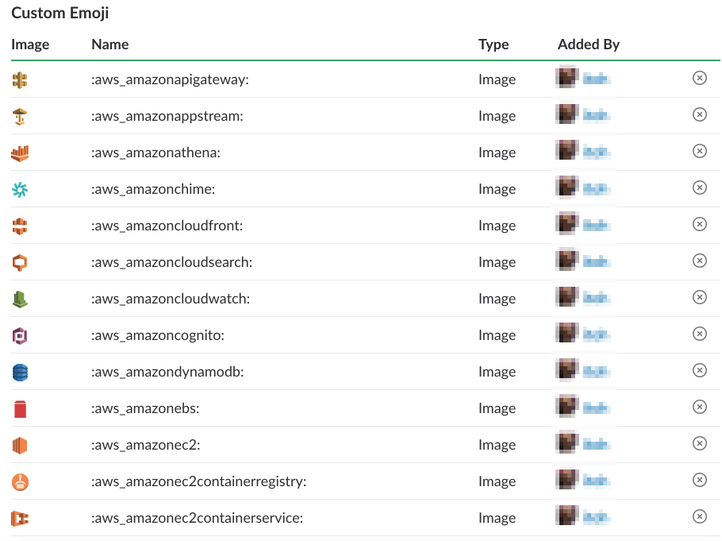

# AWS Emoji

AWS サービスアイコンの Slack 絵文字を作成するためのサーバーレスアプリケーションです。  
アイコンの元画像は、 [AWS-Karuta](https://github.com/jaws-ug/AWS-Karuta) を使用しています。




## 1. クローンとサブモジュール更新
```
git clone https://github.com/opt-itoh/aws-emoji.git
cd aws-emoji

git submodule init
git submodule update
```

## 2. 初期設定

```
npm run config -- --bucket-name="バケット名" --region="利用リージョン(省略時：us-east-1)"
```

## 3. 環境構築(SAM)

```
npm run setup
```

Windows の場合
```
npm run win-setup
```

## 4. 絵文字作成(Lambdaファンクション)

サービスアイコンの画像を Slack 絵文字に適したサイズに加工します。

```
npm run invoke-lambda
```

Windows の場合
```
npm run win-invoke-lambda
```


## 5. ダウンロード

絵文字は `./emoji` フォルダに格納されます。

```
npm run download
```

Windows の場合
```
npm run win-download
```

## 6. 絵文字登録

`https://ワークスペース名.slack.com/customize/emoji` へアクセスし、絵文字を登録します。

※Chrome拡張機能 [Neutral Face Emoji Tools](https://chrome.google.com/webstore/detail/neutral-face-emoji-tools/anchoacphlfbdomdlomnbbfhcmcdmjej) を使用すると一括登録可能です。


## 7. 環境削除

```
npm run delete-stack
npm run delete-bucket
```

Windows の場合
```
npm run win-delete-stack
npm run win-delete-bucket
```
